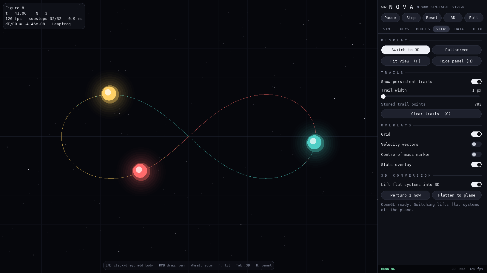
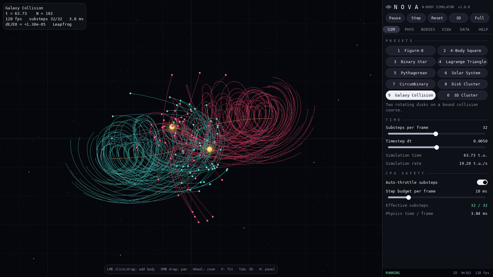
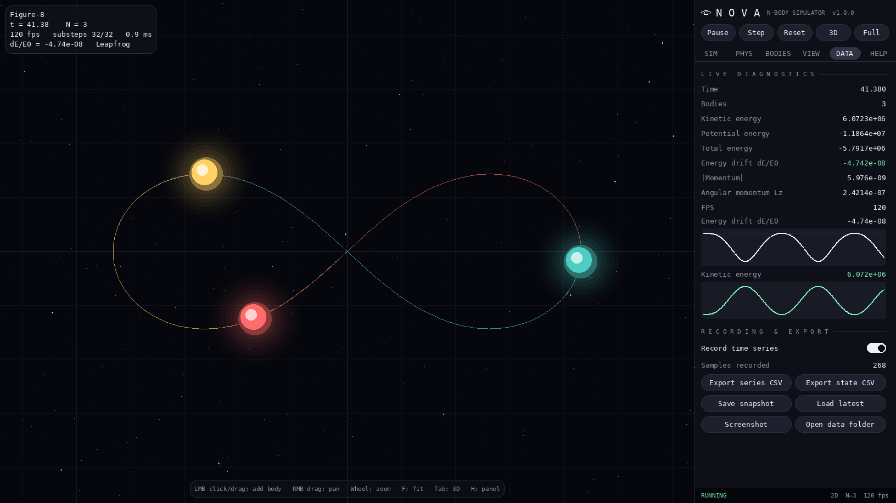

# GravBox

[](https://github.com/YOUR_USERNAME/gravbox/actions/workflows/ci.yml)


GravBox is an interactive desktop sandbox for the gravitational N-body problem. Set up
two, three or a few hundred stars in an isolated system, watch chaos unfold
with orbit trails that never fade, switch to a rotatable 3D view, and export
the energy and momentum data for analysis.

**[▶ Try the live web demo](https://YOUR_USERNAME.github.io/gravbox/)**: runs in your browser, no install.



## Features

- **Accurate physics.** A vectorised numpy engine with Plummer softening and a
  symplectic leapfrog integrator keeps energy error around 1e-7 on the built-in
  presets. Euler and RK4 are included for comparison.
- **Ten presets.** Figure-8 choreography, the Pythagorean three-body problem,
  an unstable 4-body square, binary and circumbinary systems, a solar system,
  a collapsing disk, a galaxy collision and a 3D cluster.
- **Tabbed control panel.** SIM, PHYS, BODIES, VIEW, DATA and HELP tabs, with
  live sliders for G, softening, timestep, substeps and damping.
- **Persistent trails.** Orbit paths stay on screen for the whole run, including
  bodies that merged or were removed, with bounded memory.
- **2D and 3D.** One click lifts a flat system into three dimensions and opens
  an OpenGL view with an orbit camera.
- **Fullscreen and correct aspect ratio.** DPI-aware window sizing that fits
  your screen at 16:9, is freely resizable, and has native-resolution
  fullscreen (F11).
- **CPU safety.** A watchdog automatically reduces substeps when physics
  exceeds its per-frame time budget, so the UI never freezes.
- **Data you can use.** Live energy, momentum and angular momentum readouts with
  graphs, plus CSV export, JSON snapshots and screenshots.
- **Mouse spawning.** Click to add a body on a circular orbit, or drag to aim
  its velocity like a slingshot.

| Galaxy collision | Diagnostics tab |
|---|---|
|  |  |

## Web demo

`web/index.html` is a self-contained browser version of GravBox: the same softened
gravity and leapfrog integrator, persistent trails, presets, body tracking, click-and-drag
spawning, energy graph and event timeline. It has no build step and no dependencies.

**Publish it on GitHub Pages:** push the repo, then go to *Settings → Pages → Source:
GitHub Actions*. The included `.github/workflows/pages.yml` deploys the `web/` folder on
every push to `main`. The demo is then live at
`https://YOUR_USERNAME.github.io/gravbox/`.

To try it locally, open `web/index.html` in a browser, or run `python -m http.server -d web`.

## Quick start

Requires **Python 3.9 or newer**.

```bash
git clone https://github.com/YOUR_USERNAME/gravbox.git
cd gravbox
pip install -r requirements.txt
python run.py
```

Or install it as a command:

```bash
pip install .
gravbox
```

### Command-line options

```text
gravbox [--preset KEY] [--load FILE] [--3d] [--fullscreen | --windowed]
        [--data-dir DIR] [--reset-settings] [--version]
```

| Option | Description |
|---|---|
| `--preset KEY` | `figure8`, `square`, `binary`, `lagrange`, `pythagorean`, `solar`, `circumbinary`, `cluster`, `galaxies`, `cluster3d` |
| `--load FILE` | Start from a saved snapshot (`.json`) |
| `--3d` | Start in the 3D view |
| `--fullscreen` / `--windowed` | Override the saved window mode |
| `--data-dir DIR` | Where settings, exports and screenshots are stored |
| `--reset-settings` | Ignore saved settings for this run |

## Controls

### Keyboard

| Key | Action |
|---|---|
| `Space` | Play / pause |
| `Right` or `.` | Single step (pauses) |
| `R` | Reset current preset |
| `1`-`9`, `0` | Load preset |
| `Tab` | Switch 2D / 3D |
| `F11` or `Alt+Enter` | Toggle fullscreen |
| `Esc` | Leave fullscreen |
| `F` | Fit view to the system |
| `H` | Hide / show the panel |
| `C` / `T` | Clear / toggle trails |
| `G` / `V` | Toggle grid / velocity vectors |
| `+` / `-` | Double / halve substeps (simulation speed) |
| `Delete` | Remove the last body |
| `F12` or `P` | Screenshot |
| `Ctrl+S` / `Ctrl+O` | Save snapshot / load latest |
| `Ctrl+E` | Export time series CSV |
| `Ctrl+Q` | Quit |

### Mouse

| Where | Action |
|---|---|
| 2D, left click | Add a body (orbit, random or still, set in BODIES) |
| 2D, left drag | Add a body with velocity along the drag |
| 2D, right drag | Pan |
| 3D, left drag | Orbit the camera |
| 3D, right drag | Pan the camera |
| Wheel | Zoom (scrolls when over the panel) |

## The control panel

| Tab | Contents |
|---|---|
| **SIM** | Presets, substeps and timestep, simulation clock, CPU-safety budget |
| **PHYS** | G, softening, damping, integrator (Euler / Leapfrog / RK4), collision merging, centre-of-mass frame |
| **BODIES** | Spawn mode, mass and speed, body limit, scatter / remove bodies |
| **VIEW** | 2D/3D, fullscreen, fit view, trails, grid, velocity and CoM overlays, 3D conversion |
| **DATA** | Live diagnostics, energy-drift and kinetic-energy graphs, CSV export, snapshots, screenshots |
| **HELP** | Shortcut reference and data-folder location |

## Where files are saved

Settings are remembered between runs. Exports, screenshots and snapshots go to
a per-user data folder (the DATA tab has an **Open data folder** button):

| OS | Location |
|---|---|
| Windows | `%APPDATA%\GravBox\` |
| macOS | `~/Library/Application Support/GravBox/` |
| Linux | `~/.local/share/gravbox/` |

Override it with `--data-dir DIR` or the `GRAVBOX_DATA_DIR` environment variable.

## How it works

See **[docs/PHYSICS.md](docs/PHYSICS.md)** for the force law, softening,
integrators, CPU watchdog, CSV column definitions and what to look for in each
preset.

### Project layout

```text
gravbox/
├── run.py                     # run from a source checkout
├── pyproject.toml             # packaging, `gravbox` entry point, tool config
├── requirements.txt
├── src/gravbox/
│   ├── app.py                 # main loop, actions, input handling, CLI
│   ├── physics.py             # vectorised engine, integrators, merging
│   ├── presets.py             # built-in initial conditions
│   ├── trails.py              # persistent, memory-bounded trails
│   ├── recorder.py            # energy / momentum time series
│   ├── storage.py             # snapshots (JSON) and state export (CSV)
│   ├── config.py              # settings dataclasses + tolerant persistence
│   ├── paths.py               # per-user data folders
│   ├── window.py              # sizing, aspect ratio, fullscreen
│   ├── platform_utils.py      # Windows high-DPI setup
│   ├── render/
│   │   ├── camera.py          # 2D / 3D cameras (pure math)
│   │   ├── renderer2d.py      # pygame renderer with cached trail layer
│   │   └── renderer3d.py      # OpenGL renderer + UI texture overlay
│   └── ui/
│       ├── theme.py           # colours, fonts, resolution-independent scaling
│       ├── widgets.py         # buttons, sliders, toggles, graphs...
│       ├── layout.py          # vertical flow layout builder
│       ├── panel.py           # the tabbed control panel
│       └── hud.py             # on-canvas overlays
├── tests/                     # pytest suite (no display required)
├── docs/                      # physics notes and screenshots
└── scripts/build_executable.py
```

## Development

```bash
pip install -e ".[dev]"
ruff check src tests
pytest
```

The physics, presets, trails, recorder, storage, config and camera modules
have no pygame dependency and are covered by the test suite, which runs on
Windows, macOS and Linux in GitHub Actions.

## Building a standalone executable

```bash
pip install -e ".[build]"
python scripts/build_executable.py            # folder build in dist/GravBox/
python scripts/build_executable.py --onefile  # single file
```

## Troubleshooting

- **`pip install pygame` fails on a very new Python.** Install the drop-in
  community fork instead: `pip install pygame-ce`. It uses the same `import pygame`.
- **The 3D button is greyed out.** PyOpenGL is missing or no OpenGL driver is
  available. Run `pip install PyOpenGL`; the rest of the app works without it.
- **The simulation runs slowly with many bodies.** Check the DATA tab. If it
  says *THROTTLED*, the watchdog is protecting the UI: lower substeps, remove
  bodies, or raise the step budget in SIM.
- **Bodies fly apart after a close encounter.** Increase the softening length
  or decrease the timestep, or enable collision merging.
- **The window is blurry or the wrong size on Windows.** The app requests
  per-monitor DPI awareness at start-up. If a Python launcher overrides that,
  set *Properties → Compatibility → Change high DPI settings → Override
  scaling: Application* on `python.exe`.

### Why OpenGL rather than Vulkan?

Python has no maintained high-level Vulkan binding; raw Vulkan needs a
hand-written swapchain, render pass, pipeline and SPIR-V shaders before
anything appears on screen. OpenGL provides the same hardware-accelerated
result for this workload and runs on every desktop GPU driver.

## License

[MIT](LICENSE)
